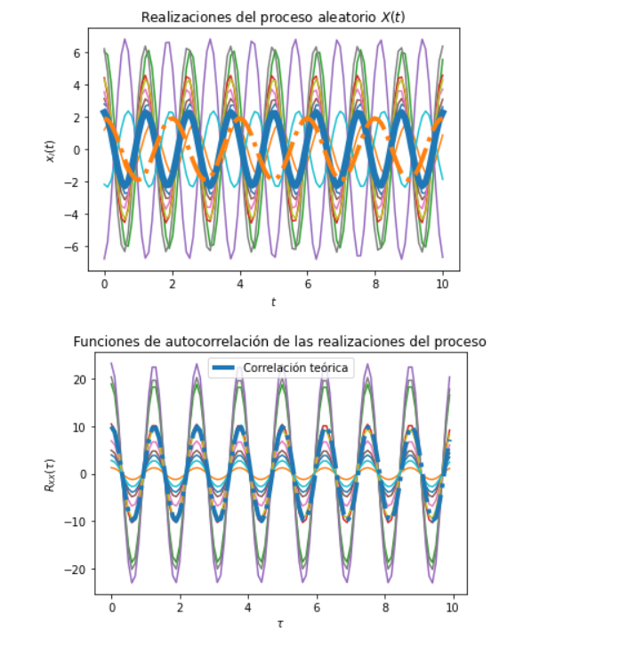

# Tema4

# `L4` - *Procesos Aleatorios*

Se logra modificar el codigo y ajustar las funciones correspondientes para obtener la solucion del problema 1 de la practica en cuestion,
obteniendo como resultado las siguientes graficas, se ajusto con valores constantes aleatorios manteniendo las distribucioniones utilizadas
para obtener resultados acordes con lo estudiado y ajustados a los valores esperados de las funciones.

 

# B10001
# Marcelo Abad
